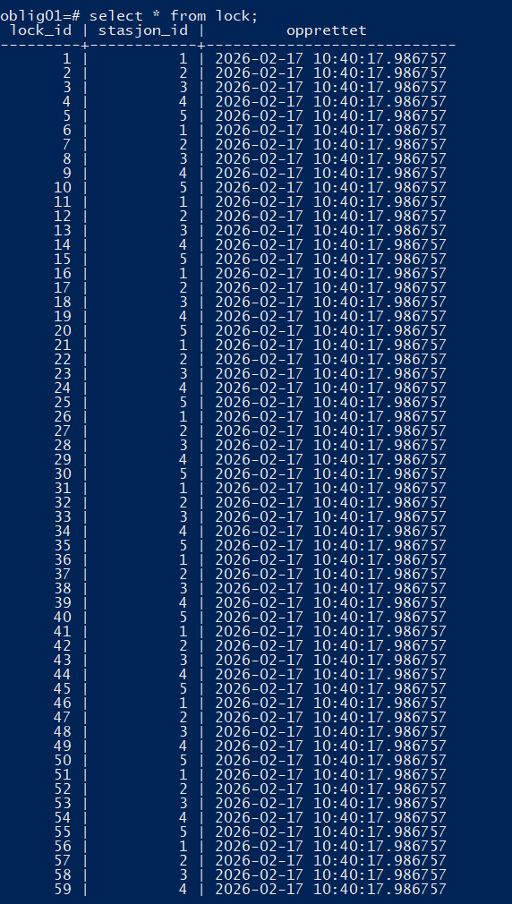
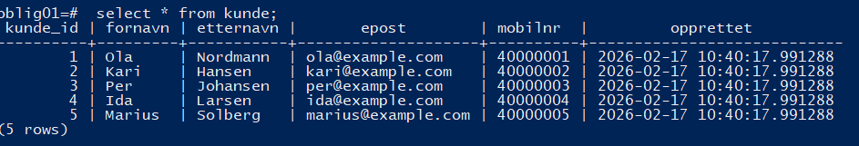
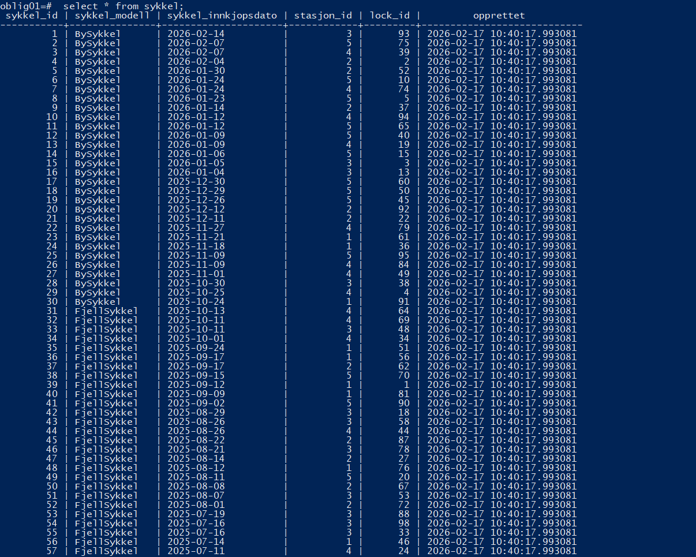
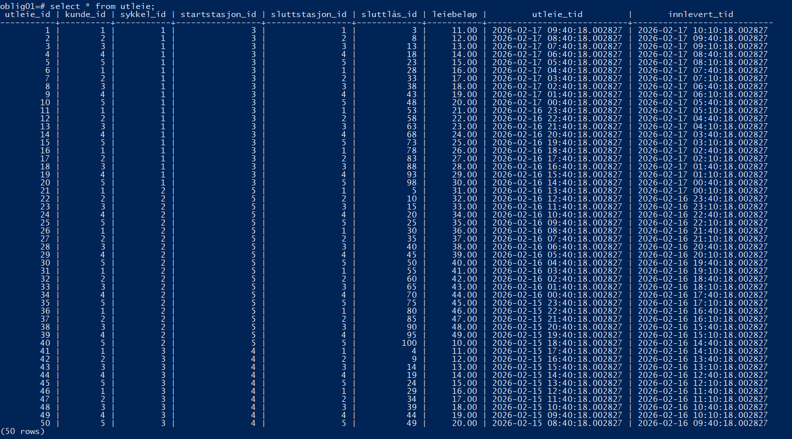

# Besvarelse - Refleksjon og Analyse

**Student:** Birk Bredland

**Studentnummer:** 405082

**Dato:** [Innleveringsdato]

---

## Del 1: Datamodellering

### Oppgave 1.1: Entiteter og attributter

**Identifiserte entiteter:**

Sykkelstasjon
Lock
kunde
sykkel 
utleie

I systemet har jeg mange sykler fordelt på ulike sykkelstasjoner. En sykkelstasjon har flere låser og for å finne frem hvor en sykkel står er det greit å lage en lås-entitet for å se hvilken lås gitt sykkel står på.  
Systemet har kunder som kan registrere seg for å bruke programmet. Og en Utleie-entitet for å ha kontroll på alle utleier som skjer. Da har man kontroll på syklene sine

**Attributter for hver entitet:**

  ###Alle Entitetene har en id og en opprettet timestamp. Det er greit å se når det ble lagt inn f.eks hvis en sykkelstasjon har bygget ut en til lås. Og det er greit å ha id på alt.
  Sykkelstasjon
    stasjon_id
    stasjon_navn
    adresse
    opprettet
      ### Her har jeg sett på csv-filen under data. Der så jeg at det var greit å ha med både navn og adresse. Adresse er fint hvis man skal implementere veibeskrivelse.
  Lock
    lock_id
    stasjon_id
    opprettet
      ### Vi trenger ikke se om den er låst eller ulåst. Vi trenger ikke se på om en lås har en sykkel da alle låser er like, men det er greit å sjekke hvilken lås en sykkel står på. Sykkel har en attributt som er tilknyttet til en lås. Den er tilknyttet hvis den er låst. Hvis vi vil sjekke om det er noen ledige låser kan vi lage en view som teller antall sykler tilknyttet stasjonen og teller antall låser i stasjonen. Hvis antall sykler er mindre enn antall låser, vet vi at det er ledig plass.
  kunde
    kunde_id
    fornavn
    etternavn
    epost
    mobilnr
    opprettet
      ### Ganske rett frem. Disse ser man i data/utleier.csv
  sykkel 
    sykkel_id
    sykkel_modell
    sykkel_innkjopsdato
    stasjon_id
    lock_id
    opprettet
      ### Modell og innkjopsdato så jeg i utleier.csv. Jeg har med stasjon_id og lock_id for å se hvilken stasjon og hvilken lås den står på. Hvis man vil sjekke opp i en spesifikk sykkel kan man finne ut hvor den ligger. Hvis stasjon og lock er NULL, vet man at sykkelen er for øyeblikket utleid. 
  utleie
    utleie_id
    kunde_id
    sykkel_id
    startstasjon_id
    sluttstasjon_id
    sluttlås_id
    leiebeløp
    utleie_tid
    innlevert_tid
      ### Her tar vi inn hvilken kunde som leier ut hvilken sykkel. Vi har også lyst til å se på start og sluttstasjon, samt sluttlås. Da vet vi hvor sykkelen kommer fra og hvilken stasjon og lås den har blitt plassert på. Jeg har med leiebeløp for prisen. Og utleie_tid og innlevert_tid. Da kan man se hvor lenge den var leid ut, samt tid*pris for riktig beløp.
  ---

  ### Oppgave 1.2: Datatyper og `CHECK`-constraints

  **Valgte datatyper og begrunnelser:**

  SERIAL PRIMARY KEY for hvert hoved id
  VARCHAR() på div navn, adresser, epost, modell
  Varchar på mobilnr fordi den er konstant. hvis et mobilnr starter med 0 ville det blitt borte ved bruk av INT.
  NUMERIC(10,2) for beløp siden det er presist og oversiktlig. Det gir et tall på maksimalt 10 sifre med 2 desimaler. 
  TIMESTAMP på opprettet og tider. Når man lager en utleie blir utleie_tid stemplet inn. Og når man skal avslutte(som blir egen funksjon) stempler man ut. 

  **`CHECK`-constraints:**

  Jeg har lagt inn check constraint på mobilnr. Som sjekker at det er lagt inn et tall på 8 sifre. Eneste ulempen er hvis en kunde med et mobilnr fra et annet land prøver å registrere seg.
  Jeg har også lagt inn check constraint på epost. Dette sjekker at det er minst en karakter før @ og minst en karakter etter @ samt et punktum etter @ et sted. 
  Jeg har også lagt inn check constraint på leiebeløpet. Så det plutselig ikke blir negativt. 

  **ER-diagram:**

  [Legg inn mermaid-kode eller eventuelt en bildefil fra `mermaid.live` her]
  https://mermaid.live/edit#pako:eNqNVF1vmzAU_SuWn1aJVlAHyHiLUqR1yVKpSSdtijS55SalGBsZU62D_PdhPhIodBkPRvY95_qce23n-EkEgD0M8iake0njLUflt97M1l_vVqgoLi-LHC3v5gvkoS32OVIhQxYCxkCiXTnAFg85IkfrH4uFv-yyzIYVU74_sWpYRSoGG7UUS8NrwsNm6d_6tbICLR5WN36X4fM2cx84lDOOzI8-etAxwx3aOeka3h3bPfJ6qr8wQKmi6Yvgv8LgtPx9dj__Mrv_ZJnmxRHA6SsfQq41BNFAQprCKazCGEpinCCRJBKUAlUHD_WvEt4XwsRT1FNxu9qMqjuXu25PP3mU8QBGPdpa_07IcXtVVG_xQbyqEIJEpGqsNhcoFo8h4_L_1Tdn5l2T3qII2Mc9agFxebEYO4ECqgCFnEcvIknLiThfXb0-aMU50c2p7IvOFIMQBsmHraikDB02CqVqZL6LsEz9I6ItdNRwhR6BiWTMUqNTjRsuq8fgFWRrGBt4L8MAezvKUjBwDDKmeo4r91usniEur6u-lQGVkb6JmpRQ_lOIGHtKZiVNimz_fEySJbpTzWt4XJVQVkrORcYV9ix7MqmyYC_Hv7FHLOfKdYh1bZHpxCUuMfAb9swr0_5MppbtuISYtmM6zsHAf6qNrTI2dW3TJIS4U8e0DAxBqIT8Vj_H1at8-AulzKHd 
  ---

  ### Oppgave 1.3: Primærnøkler

  **Valgte primærnøkler og begrunnelser:**

  [Skriv ditt svar her - forklar hvilke primærnøkler du har valgt for hver entitet og hvorfor]
  Jeg har lagt inn en id for hver entitet og brukt det som primær nøkkel. ([entitet]_id)

  **Naturlige vs. surrogatnøkler:**

  [Skriv ditt svar her - diskuter om du har brukt naturlige eller surrogatnøkler og hvorfor]
  Her har jeg brukt bare surrogatnøkler. Istedenfor å hente opp navn på feks stasjon, velger jeg å hente opp id. Da er det ingen risiko for duplikater eller misforståelse da 2 kunder kan ha samme navn. Eller at 2 forskjellige byer kan ha lik adresse.

  **Oppdatert ER-diagram:**

  [Legg inn mermaid-kode eller eventuelt en bildefil fra `mermaid.live` her]
  https://mermaid.live/edit#pako:eNqNVNFumzAU_RXLT6uUVqYukPEWpUjryNKpSSetilS55SalGBsZU60l-fdhIAkJdBkPRvY95_qce20X-FmGgD0M6jpiK8WShUDlN5uPZt9vp2i9Pj9fF2hyOw6QhxbYF0hHHFkIOAeFluUAC9zlyALNfgeBP2mzSMNKmFjtWTWsIq07G20ploHXhPv5xL_xa2VrFNxPr_02wxfbzIfArpx-ZLHzcQDtM9yinZJu4O1xu0dRT80XhT8DlGmWvUrxGIX7wK_R3fjb6O6LRcjZDiDYm-hCLg0EsVBBlsE-rKMESmKSIpmmCrQGXQc39a-SfiyFy-f4QMfNdN6r71T2ukXH6eNchNDr0zYellL1W6yiZpNP4lWVEKQy0331OUOJfIq4UP-vvzk5nVa9xzHwzzu1BSTlBeN8DwqZBhQJEb_KNCsn8nSFzXqnHadkN6fzWHauOUTQSd9tRyWm67HRqHQj9CjCc_2PiDHR0iM0egIu0z5TjU7db7msH4c3UFvLeIBXKgqxt2Q8gwFOQCXMzHHlf4H1CyTlxTX3M2QqNnfSkFImHqRMsKdVXtKUzFcvuyR5anrVvIu7VQVlpdRY5kJjz7KHV1UW7BX4D_ao5Vy4DrUuLTq8cqlLB_gde-SC2F_p0LIdl1JiO8RxNgP8UW1slbGhaxNCKXWHDrEGGMJIS_Wjfpir93nzF0hJpOg 
  ---

  ### Oppgave 1.4: Forhold og fremmednøkler

  **Identifiserte forhold og kardinalitet:**

  [Skriv ditt svar her - list opp alle forholdene mellom entitetene og angi kardinalitet]
    
    STASJON ||--o{ LOCK : "En-til-mange"
    STASJON ||--o{ SYKKEL : "En-til-mange"

    LOCK ||--o| SYKKEL : "En-til-null-eller-en"

    KUNDE ||--o{ UTLEIE : "En-til-mange"
    SYKKEL ||--o{ UTLEIE : "En-til-mange"

    STASJON ||--o{ UTLEIE : "En-til-mange"
    STASJON ||--o{ UTLEIE : "En-til-mange"

    LOCK ||--o{ UTLEIE : "En-til-mange"

  **Fremmednøkler:**

  [Skriv ditt svar her - list opp alle fremmednøklene og forklar hvordan de implementerer forholdene]
  I Lock-tabellen:
    stasjon_id INT NOT NULL REFERENCES sykkelstasjon(stasjon_id)
      En lås tilhører en stasjon. En stasjon har mange låser

  Sykkel-tabellen:
    stasjon_id INT REFERENCES sykkelstasjon(stasjon_id)
      En stasjon har mange sykler. En sykkel står ved en stasjon gitt ved "null" eller stasjon_id
    lock_id INT REFERENCES lock(lock_id)
      En lås kan holde 0 eller 1 sykkel. En sykkel kan stå i 0 eller 1 sykkel. 

  Utleie-tabellen:
    kunde_id INT NOT NULL REFERENCES kunde(kunde_id)
      En utleie tilhører en kunde. En kunde kan ha flere utleier.
    sykkel_id INT NOT NULL REFERENCES sykkel(sykkel_id)
      En utleie tilhører en sykkel. En sykkel kan ha mange utleier over tid.
    startstasjon_id INT NOT NULL REFERENCES sykkelstasjon(stasjon_id)
      En stasjon kan være startpunkt for mange utleier. Utleien starter på en stasjon
    sluttstasjon_id INT REFERENCES sykkelstasjon(stasjon_id)
      En stasjon kan være sluttpunkt for mange utleier. Utleien avsluttes på en stasjon.
    sluttlås_id INT REFERENCES lock(lock_id)
      En lås kan brukes i mange utleier. En utleie avsluttes i en lås

  **Oppdatert ER-diagram:**

  [Legg inn mermaid-kode eller eventuelt en bildefil fra `mermaid.live` her]
  https://mermaid.live/edit#pako:eNqNVF1vmzAU_SuWn1YpVATK-HiLUqR1ZOnUpJM2IU1uuU0pxkbGVGuT_PfZfCRNoE39ALLvucfn3Gt7je95AjjAIC5TshIkj9liOVl8v56jzcYw-BotfkdROEMBinHIDJlSIydsBTGOWcwQml1Powa6GYCyilIDKAVhAOtSotv5ZdjR3y5n4VU4SI86wtPQGnyo-2PiT2MPPZ6gRejtt9tk3Uz1SJOfESolKZ84-5sm-8Cvyc302-Tmy9g0z3YARp5ZH2JpCCKJgLKEfVimOajEvEC8KARICbIJbptfbeJYCuX32YGOq_lyUN8p9qanx_RZxRIY9OloDw9cDFuso3qTd-J1lRAUvJRD9TlDOb9LKROf19-etF6rXrIM6Pud6gC5ukWU7kEJkYBSxrInXpRqwk9XWK_32nFKdnsaj2VXkkIKPfp-O2oxfY-tRiFboUcRWskPItrEGz1MojugvBgy1eqUw5ZV_Sg8g-gs4xFeiTTBwQOhJYxwDiIneo5r_zGWj5Crm6jvZkJEpu-kTioI-8N5jgMpKpUmeLV63JFUhe5V-_jtVgWoSokpr5jEwdjx_ZoFB2v8DweWa5_79tj66jqe-l84I_yCA8dUi-6F77meZfm2bW9H-LXe1jz31Loarm96lm37KgGSVHLxo3l86zd4-x-NpKKh 
  ---

  ### Oppgave 1.5: Normalisering

  **Vurdering av 1. normalform (1NF):**

  [Skriv ditt svar her - forklar om datamodellen din tilfredsstiller 1NF og hvorfor]
  Alle attributtverdiene er atomære. Det finnes ingen repeterende grupper eller lister med verdier i tabellene.

  **Vurdering av 2. normalform (2NF):**

  [Skriv ditt svar her - forklar om datamodellen din tilfredsstiller 2NF og hvorfor]
  Jeg bruker bare surrogatnøkler. Det er ingen sammensatte nøkler.

  **Vurdering av 3. normalform (3NF):**

  [Skriv ditt svar her - forklar om datamodellen din tilfredsstiller 3NF og hvorfor]
  Alle attributter beskriver kun entiteten de tilhører og det er ingen tilfeller med transitiv avhengighet.

  **Eventuelle justeringer:**

  [Skriv ditt svar her - hvis modellen ikke var på 3NF, forklar hvilke justeringer du har gjort]

  ---

## Del 2: Database-implementering

### Oppgave 2.1: SQL-skript for database-initialisering

**Plassering av SQL-skript:**

[Bekreft at du har lagt SQL-skriptet i `init-scripts/01-init-database.sql`]

**Antall testdata:**

- Kunder: [5]
- Sykler: [100]
- Sykkelstasjoner: [5]
- Låser: [20 per stasjon]
- Utleier: [50]

---

### Oppgave 2.2: Kjøre initialiseringsskriptet

**Dokumentasjon av vellykket kjøring:**

[Skriv ditt svar her - f.eks. skjermbilder eller output fra terminalen som viser at databasen ble opprettet uten feil]!
    
Jeg hadde noen feil under oppstart. Hadde glemt noen parametere og da hadde programmet stoppet. Jeg hadde også feil i den genererte utleie med samme kunde_id, sluttstasjon og sluttlås for alle utleiene. Jeg endte opp med å gå vekk fra random() og bruke row_number() over(). Ved hjelp av KI fant jeg ut at random() i subqueries evalueres ofte en gang per query og ikke per rad. Det var derfor jeg endte opp å få lik id hver gang. Rownumber går gjennom rad for rad og gir meg et nytt tall hver gang som de kommer ut. For kunde og sluttstasjon rulerer den bare gjennom de 5. 
Siden den bare rulerer på sykkel_id og start-/slutt-stasjon vil ikke utleien gi 100% mening. Da sykkelen står kanskje på stasjon 1, men i neste utleie er start fra stasjon 5. 

**Spørring mot systemkatalogen:**

```sql
SELECT table_name 
FROM information_schema.tables 
WHERE table_schema = 'public' 
  AND table_type = 'BASE TABLE'
ORDER BY table_name;
```

**Resultat:**

```
[Skriv resultatet av spørringen her - list opp alle tabellene som ble opprettet]
```
    table_name
  ---------------
  kunde
  lock
  sykkel
  sykkelstasjon
  utleie
  (5 rows)
  ---

## Del 3: Tilgangskontroll

### Oppgave 3.1: Roller og brukere

**SQL for å opprette rolle:**

```sql
[Skriv din SQL-kode for å opprette rollen 'kunde' her]
CREATE ROLE kunde_role LOGIN PASSWORD 'kunde';
```


**SQL for å opprette bruker:**

```sql
[Skriv din SQL-kode for å opprette brukeren 'kunde_1' her]
CREATE USER kunde_1 LOGIN PASSWORD 'kunde1pass';
```

**SQL for å tildele rettigheter:**

```sql
[Skriv din SQL-kode for å tildele rettigheter til rollen her]
GRANT SELECT ON sykkelstasjon TO kunde_role;
GRANT SELECT ON sykkel TO kunde_role;

GRANT kunde_role TO kunde_1;
```

---

### Oppgave 3.2: Begrenset visning for kunder

**SQL for VIEW:**

```sql
[Skriv din SQL-kode for VIEW her]
CREATE TABLE kunde_bruker_map (
    brukernavn TEXT PRIMARY KEY,
    kunde_id INT NOT NULL REFERENCES kunde(kunde_id)
);

INSERT INTO kunde_bruker_map VALUES ('kunde_1', 1);

CREATE VIEW utleie_kunde_view AS
SELECT u.*
FROM utleie u
JOIN kunde_bruker_map m ON u.kunde_id = m.kunde_id
WHERE m.brukernavn = CURRENT_USER;

GRANT SELECT ON utleie_kunde_view TO kunde_role;
```

**Ulempe med VIEW vs. POLICIES:**

[Skriv ditt svar her - diskuter minst én ulempe med å bruke VIEW for autorisasjon sammenlignet med POLICIES]
En view er bare en visning av gitt data, hvis man får tilgang til selve tabellen kan man omgå hele viewet. Policy er direkte sikkerhet i selve tabellen som ikke kan omgås.

---

## Del 4: Analyse og Refleksjon

### Oppgave 4.1: Lagringskapasitet

**Gitte tall for utleierate:**

- Høysesong (mai-september): 20000 utleier/måned
- Mellomsesong (mars, april, oktober, november): 5000 utleier/måned
- Lavsesong (desember-februar): 500 utleier/måned

**Totalt antall utleier per år:**

[Skriv din utregning her]
20000 * 5 = 100000
5000 * 4 =   20000
500 * 3 =     1500
100000+20000+1500 = 121500 utleier ila et år. 

**Estimat for lagringskapasitet:**

[Skriv din utregning her - vis hvordan du har beregnet lagringskapasiteten for hver tabell]
I utleie har vi 
6 int
1 numeric
2 timestamp

1 int tilsvarer 4 byte
1 numeric tilsvarer mellom 5-9 byte. Vi sier 8 så vi får et fint tall.
1 timestamp tilsvarer 8 byte.

6*4+8+2*8= 48 byte 
48 * 121500 = 5832000 byte = 5,832 MB 
Kan runde opp til 6 MB for alle utleier.

Sykkel har
2 int 4 byte
1 varchar(100) bruker antall_tegn + 1 byte
En fjellsykkel er den lengste modellen enn så lenge med 11 tegn.
1 date bruker 4 byte
1 timestamp 8 byte

2*4 + 12 + 4 + 8 = 32 byte 
32 * 100 = 3200 byte

Sykkelstasjon har 2 varchar og en timestamp.
Vi runder opp og sier gjennomsnittlig varchar har 20 byte
48 byte * 5 =  240 byte 

kunde har 4 varchar og en timestamp
Vi runder opp og sier gjennomsnittlig varchar har 16.
72 byte 
Det har nok dukket opp ganske mange kunder. Mtp på at det er 121500 utleier ila et år kan vi anta at 1/5 av de er nye brukere. 
72 * 24300 = 1749600 byte = 1.7496 MB
Runder opp til 2 MB.

Lock har en int og en timestamp.
12 * 100 = 1200 byte


**Totalt for første år:**

[Skriv ditt estimat her]
6MB + 2MB + 3200 byte + 240 byte + 1200 byte 
= 8.004640 MB
Jeg ville rundet opp til 10 da det ligger nok litt mer bak det.

Det tar veldig lite lagring, men for å ferdigstille databasen for å kunne bli brukt ordentlig. Legge til feks audit-log osv. Ville jeg satt av 20-30 MB ila et år om ikke mer.

---

### Oppgave 4.2: Flat fil vs. relasjonsdatabase

**Analyse av CSV-filen (`data/utleier.csv`):**

**Problem 1: Redundans**

[Skriv ditt svar her - gi konkrete eksempler fra CSV-filen som viser redundans]
Ole Hansen blir lagret 3 ganger i denne csv-filen. 
Sentrum Stasjon, Karl Johans gate 1 oslo lagres også 3 ganger '
Også sykkel City Bike Pro blir lagret flere ganger. 

**Problem 2: Inkonsistens**

[Skriv ditt svar her - forklar hvordan redundans kan føre til inkonsistens med eksempler]
Det kunne blitt en lagringsfeil som hadde gjort at det er 2 forskjellige mobilnr til ole hansen. Da vet ikke systemet hva som er riktig.
Samme med stasjon og sykler. 

**Problem 3: Oppdateringsanomalier**

[Skriv ditt svar her - diskuter slette-, innsettings- og oppdateringsanomalier]
Problemet med csv er at man må ha all informasjon skrevet ned for at raden skal bli satt inn. 
I en normalisert database som min, trenger du egentlig bare kunde_id, sykkel_id og stasjon_id. istedenfor å måtte skrive hele navnet på adressen og navnet helt riktig. 
Hvis en kunde skal oppdatere informasjon må du plutselig oppdatere alle radene i csv-filen for alle utleiene. Med normalisert database trenger du kun å oppdatere en rad i "kunde".
Hvis du lagrer informasjon på denne måten kan du fort slette mer informasjon enn tenkt når du sletter. 

**Fordeler med en indeks:**

[Skriv ditt svar her - forklar hvorfor en indeks ville gjort spørringen mer effektiv]
En indeks gjør at man kan hoppe rett til riktige raden der informasjonen ligger. Istedenfor at man må gå gjennom alle rader for å finne informasjonen man vil. 

**Case 1: Indeks passer i RAM**

[Skriv ditt svar her - forklar hvordan indeksen fungerer når den passer i minnet]
Når hele indeksen ligger i RAM kan den direkte se søket ditt. 
Tenk det er 3 objekter foran deg og du skal finne det ene objektet. Det er ganske lett å se uten å trenge å lete.
RAM kan gjøre nettopp dette prinsippet med mange mange objekter i minnet. Og den kan lett se hvor objektet ligger uten at den trenger å lete. 

**Case 2: Indeks passer ikke i RAM**

[Skriv ditt svar her - forklar hvordan flettesortering kan brukes]
Hvis det ikke er plass i RAM begynner den med flettesortering. Det går ut på at den først sorterer så mye som den får plass til og skriver kjøringen inn til disk. Så tar den opp ny informasjonen og "fletter" dem sammen i flere pass. Da er det sortert uten at alt får plass i minnet. Det går tregere enn når alt får plass i minnet, men raskere enn å sjekke gjennom hver eneste rad. 

**Datastrukturer i DBMS:**

[Skriv ditt svar her - diskuter B+-tre og hash-indekser]
Et B+-tre er et sortert tre. Se for deg et tre der data ligger i bladene og nøklene ligger sortert i disse bladene. Forestill deg en telefonkatalog der man kan hoppe direkte til riktig bokstav, riktig side og riktig navn. 
Hash gir nøkler en hash(verdi) og funker ekstremt raskt for likhetssøk. Men den er ikke sortert.
Hash funker raskere, men hvis man vil sortere eller rangesøke egner b+-treet seg mye bedre. 
---

### Oppgave 4.3: Datastrukturer for logging

**Foreslått datastruktur:**

[Skriv ditt svar her - f.eks. heap-fil, LSM-tree, eller annen egnet datastruktur]
LSM-tree

**Begrunnelse:**
**Skrive-operasjoner:**

[Skriv ditt svar her - forklar hvorfor datastrukturen er egnet for mange skrive-operasjoner]
Når man skal logge hendelser vil man at det skal logges når det skjer. Og da er det greit at loggen blir i rekkefølge på når hendelser har skjedd. Derfor er det best med LSM-tree eller Heap-fil. Begge fungerer slik at nye hendelser legges til på slutten av filen uten å måtte flytte data eller rebalansere treet(b+-tre).

**Lese-operasjoner:**

[Skriv ditt svar her - forklar hvordan datastrukturen håndterer sjeldne lese-operasjoner]
Både lsm-tree og hash hadde vært gode nok siden logging ikke krever komplekse spørringer.
Men siden vi har lyst til å kunne søke opp og lese, passer LSM-tree bedre da den har mindre søkekostnad enn en heap-fil. 
---

### Oppgave 4.4: Validering i flerlags-systemer

**Hvor bør validering gjøres:**

[Skriv ditt svar her - argumenter for validering i ett eller flere lag]
Jeg ville gjort det i alle lag. Da kan man gi god brukeropplevelse i frontend og sterk sikkerhet. Så er det flere usikkerheter og svakheter. 

**Validering i nettleseren:**

[Skriv ditt svar her - diskuter fordeler og ulemper]
Det er lett å sjekke opp simple skrivefeil og passe på at informasjonen blir skrevet i riktig format. 
Ulempe er at det er veldig lett å komme seg rundt da dette kjøres på maskinen til brukeren. Hvis dette hadde vært eneste valideringen hadde det vært kraftige sikkerhetsbrudd.
Bra for brukeropplevelse

**Validering i applikasjonslaget:**

[Skriv ditt svar her - diskuter fordeler og ulemper]
Den kan sjekke feks om epost/mobilnr finnes allerede eller sjekke om sykkelen er ledig osv. 
Ulempe er at dette også kan omgås.
Hovedlaget for logikk og regler.

**Validering i databasen:**

[Skriv ditt svar her - diskuter fordeler og ulemper]
Kan ikke omgås og sikrer dataintegritet. 
Ulemper er at man ikke får gode feilmeldinger. 


**Konklusjon:**

[Skriv ditt svar her - oppsummer hvor validering bør gjøres og hvorfor]
Validering bør gjøres i alle lag for ulike grunner. 
Det gir god brukeropplevelse, sterk sikkerhet, konsistent data og beskyttelse mot feil. 

---

### Oppgave 4.5: Refleksjon over læringsutbytte

**Hva har du lært så langt i emnet:**

[Skriv din refleksjon her - diskuter sentrale konsepter du har lært]
Det har vært en tung oppgave, men har tvunget meg til å sette meg godt inn i hvordan ting fungerer. Jeg har sett gjennom mye av de forrige oppgavesettene over hvordan de databasene og kommandoene er bygd opp.
Lage en docker/postgresql slik at man for testet i en container. Det å designe en hel database fra bunnen av. Normalisere data, lage tabeller, fylle med data, lage roller, brukere, gi dem tilgangskontroll. Diverse views. Jobbet med sikkerhet og autorisasjon. 

**Hvordan har denne oppgaven bidratt til å oppnå læringsmålene:**

[Skriv din refleksjon her - koble oppgaven til læringsmålene i emnet]

Se oversikt over læringsmålene i en PDF-fil i Canvas https://oslomet.instructure.com/courses/33293/files/folder/Plan%20v%C3%A5ren%202026?preview=4370886

**Hva var mest utfordrende:**

[Skriv din refleksjon her - diskuter hvilke deler av oppgaven som var mest krevende]
Det mest utfordrende var å få effektisert tabellene slik at de henger sammen på en logisk måte. Det at alt må henge sammen og gi mening, men jeg fikk ryddet opp og tenkt riktig når jeg tegnet det opp i mermaid.live. 
Det var også komplisert å generere noe lunde realistisk data. Jeg litt feil med at flere sykler endte opp i samme lås. Eller at alle syklene endte opp på en stasjon. 
Jeg endte opp med å fikse så det ble rullert slik at det ikke var de samme tallene som ble brukt. Den nyeste utleien stemmer kanskje ikke overens med der syklene ligger nå, men vi kan anta en varebil har kommet og sortert syklene til der de står nå. 
Hvis man hadde fått en ny utleie, hadde jeg passet på at alt ble riktig. Det er litt lettere å kode riktig logikk i applikasjon enn på sql. Da blir det også en mye ryddigere database. 

**Hva har du lært om databasedesign:**

[Skriv din refleksjon her - reflekter over prosessen med å designe en database fra bunnen av]
Struktur og integritet er viktig helt fra starten. Det å tenke gjennom godt nok, slik at du ikke trenger å gå tilbake masse steg for å fikse opp. Sikre at data i tabellene forblir konsistente, logiske og enkle å jobbe med. Samtidig tenke på normalisering og sikkerhet. 
---

## Del 5: SQL-spørringer og Automatisk Testing

**Plassering av SQL-spørringer:**

[Bekreft at du har lagt SQL-spørringene i `test-scripts/queries.sql`]
Det har jeg!

**Eventuelle feil og rettelser:**

[Skriv ditt svar her - hvis noen tester feilet, forklar hva som var feil og hvordan du rettet det]
Ingen feil!
---

## Del 6: Bonusoppgaver (Valgfri)

### Oppgave 6.1: Trigger for lagerbeholdning

**SQL for trigger:**

```sql
[Skriv din SQL-kode for trigger her, hvis du har løst denne oppgaven]
```

**Forklaring:**

[Skriv ditt svar her - forklar hvordan triggeren fungerer]

**Testing:**

[Skriv ditt svar her - vis hvordan du har testet at triggeren fungerer som forventet]

---

### Oppgave 6.2: Presentasjon

**Lenke til presentasjon:**

[Legg inn lenke til video eller presentasjonsfiler her, hvis du har løst denne oppgaven]

**Hovedpunkter i presentasjonen:**

[Skriv ditt svar her - oppsummer de viktigste punktene du dekket i presentasjonen]

---

**Slutt på besvarelse**
